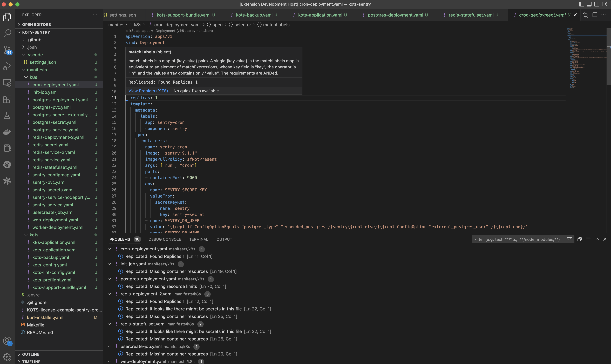

# Replicated VSCode extension

The Replicated VSCode extension allows to enable linting of your kubernetes manifest files directly within VSCode.

## Features

Once the extension is installed, it can be enabled by using the command `Replicated Lint Enable`. Once enabled, on each save it will send the manifests to the Replicated Lint server and report results in the Diagnostics Problems view.

To disable the linting, you can run the command `Replicated Lint Disable`.

Manifests are expected to be located under the `manifests` folder (default), which can be changed in the extension settings.

## Extension Settings

This extension contributes the following settings:

* `config.manifestsFolder`: Location for the Replicated yaml manifests (default: manifests)
